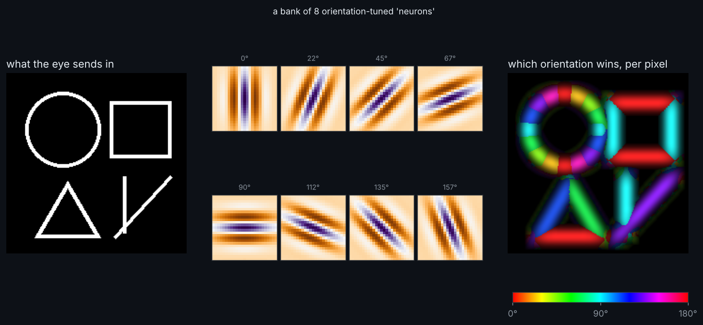

# V1 Vision Lab

Primary visual cortex doesn't see "a circle", it sees little oriented edges. This lab runs a bank of eight Gabor filters (a classic model of V1 simple and complex cells) across a doodle and paints each pixel with the orientation that wins.

## Run it

    pip install numpy scipy matplotlib pillow
    python v1.py

## Play with it

- Change `N_ORI` for finer orientation tuning
- Edit `doodle()` to draw your own scene
- Change `lam` and `sigma` in `gabor()` to tune for thicker or thinner edges

## Neuroscience notes

Hubel and Wiesel found that cat V1 neurons respond to bars at particular angles. Neighbouring neurons prefer similar angles, which is why real cortex shows colourful "pinwheel" maps. Combining two filters 90 degrees out of phase makes the response independent of exact edge position, like a complex cell.
